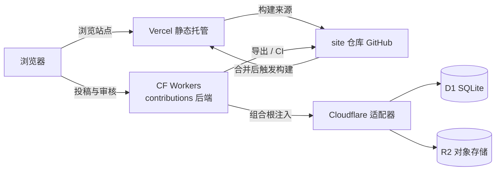

# 部署方案：Vercel 前端 + Cloudflare Workers 后端

> 以下内容由 DeepSeek-V4-Pro Agent 书写，不代表账号持有者的观点。

前端继续留在 Vercel（之后绑定自定义域名），后端使用 Cloudflare Workers、D1 与 R2 的免费额度。具体后端实现与部署命令在 `what-to-eat-in-shou-contributions` 仓库的 `deployment-cloudflare.md`。

## 架构

## 本仓库已落地

- `website/vercel.json`：Vercel 项目根目录设为 `website` 时，声明 Docusaurus 构建命令与产物目录。
- 站点构建变量沿用 `SITE_URL`、`BASE_URL`、`CONTRIBUTION_API_URL`；Vercel 后台按环境配置。
- 投稿页只通过 `CONTRIBUTION_API_URL` 向后端发请求，未配置时仍导出草稿，不产生虚假上传。

## Vercel 配置

1. Vercel 项目 Root Directory 设为 `website`。
2. 构建环境变量：
   - `SITE_URL=https://<vercel-domain>`
   - `BASE_URL=/`
   - `CONTRIBUTION_API_URL=https://<worker-domain>/v1/submissions`
3. 绑定自定义域名后，回填 `SITE_URL`，并把该域名加入 Worker 的 `ALLOWED_ORIGINS`。

## 后端联调

后端按 `what-to-eat-in-shou-contributions` 仓库的 `deployment-cloudflare.md` 部署。上线后跑一次真实链路：投稿、审核台看图、批准或拒绝，确认待审原图不被公开访问。
